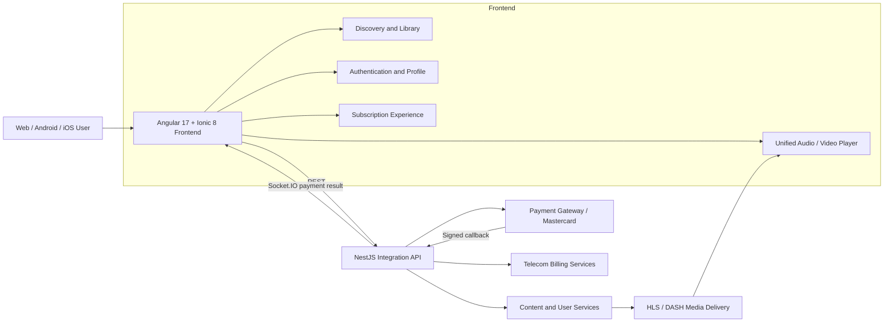

# Rotana Tunes

<div align="center">
  <p><strong>A cross platform music, video, reels, and karaoke streaming experience for web, Android, and iOS.</strong></p>

  <p>
    
    
    
    
    
    
  </p>
</div>

> **Note:** This is a portfolio case study. Project is closed source, proprietary company work built at Rockville Technologies, so no source code is included here.

## Overview

Rotana Tunes is a responsive digital entertainment platform that brings music, music videos, short form reels, live content, and karaoke into one unified experience. The product combines adaptive media streaming, persistent global players, personalized content discovery, multilingual UX, account management, subscriptions, and telecom billing in a single Angular application.

The frontend is delivered as a web application and packaged for Android and iOS through Capacitor. A modular NestJS backend acts as the integration layer for content, user, billing, subscription, and payment services.

## My Contribution

My primary responsibility was **frontend engineering across `fst-frontend`**, with an additional backend contribution focused on the **Mastercard payment flow**.

### Frontend

- Built and refined responsive experiences with Angular standalone components, Ionic, TypeScript, and SCSS.
- Developed persistent audio and video playback that continues across navigation, including minimized player and full player transitions.
- Worked on a unified media player for both audio and video content, with playlist context and playback state synchronization.
- Implemented adaptive HLS and MPEG-DASH playback, selectable video quality, fullscreen controls, seek handling, volume controls, shuffle, repeat, and playback progress.
- Delivered content discovery experiences for home sections, search, artists, albums, playlists, liked songs, recently played content, reels, karaoke, and live streams.
- Built authentication and account journeys covering OTP, email/password, Google OAuth, password recovery, profile management, and subscription status.
- Integrated subscription packages and payment method selection, including card and telecom billing journeys.
- Added real time subscription result handling with Socket.IO so the interface can react immediately to payment outcomes.
- Implemented English and Arabic localization, RTL document direction, language-aware API requests, and localized configuration.
- Added deep links, share links, short link routing, and native app URL handling across web, Android, and iOS.
- Contributed reusable services, shared components, route level lazy loading, strict templates, and responsive layouts for maintainable feature development.

### Backend: Mastercard / IPG

- Contributed to the NestJS payment integration used for Mastercard and Visa transactions.
- Implemented client credential authentication and reusable access token caching for the payment gateway.
- Supported transaction initiation and cancellation with validated DTOs and Swagger documentation.
- Handled signed payment callbacks and gateway webhook verification.
- Added transaction status normalization so card provider status variants follow one subscription activation path.
- Connected successful transactions to the subscription service and published real time results to the frontend through Socket.IO.
- Preserved transaction and customer context between initiation and asynchronous callbacks.

## Product Highlights

- **Unified streaming:** Audio and video content share a coordinated player experience.
- **Adaptive playback:** HLS and MPEG-DASH support with automatic and manual quality selection up to 1080p when available.
- **Persistent media:** Global audio and minimized video players maintain playback while users browse.
- **Personalized discovery:** Curated home sections, search, artist and album pages, favorites, history, and user playlists.
- **Rich entertainment:** Music, videos, reels, karaoke, live streams, and ring back tone journeys.
- **Cross platform delivery:** One Ionic Angular codebase targeting modern browsers, Android, and iOS.
- **Bilingual experience:** English and Arabic content with RTL aware layouts and language specific API behavior.
- **Flexible identity:** OTP, email/password, and Google OAuth authentication journeys.
- **Integrated subscriptions:** Card payments and operator billing flows within the account experience.
- **Real time updates:** WebSocket events synchronize payment and subscription results without manual refreshes.
- **Shareable content:** Deep links, short links, app links, and social preview routes take users directly to media.

## Architecture



The frontend follows a feature oriented structure with:

- **Core services** for authentication, API access, configuration, localization, playback, billing, and application state.
- **Shared UI** for reusable content sections, media items, navigation, modals, and feedback.
- **Feature pages** for discovery, search, collections, artists, playlists, reels, karaoke, live content, and the unified player.
- **Reactive state** built with RxJS observables and subjects to coordinate media, authentication, navigation, and subscription events.
- **Backend modules** that isolate content, user, billing, IPG, search, playlist, and operator integrations.

## Technology Stack

| Area | Technologies |
| --- | --- |
| Frontend | Angular 17, Ionic 8, standalone components, Angular Router |
| Language and state | TypeScript, RxJS |
| Styling | SCSS, Ionic CSS variables, responsive and RTL layouts |
| Mobile | Capacitor 7, Android, iOS |
| Audio | Howler.js, Web Audio API |
| Video | Video.js, hls.js, dash.js, HTTP Live Streaming, MPEG-DASH |
| Backend | NestJS 10, Node.js, REST APIs |
| Realtime | Socket.IO, WebSockets |
| Authentication | OTP, email/password, Google OAuth 2.0 |
| Payments | Mastercard/Visa IPG, signed callbacks, telecom direct carrier billing |
| API contracts | Swagger/OpenAPI, class-validator, class-transformer |
| Quality | ESLint, Prettier, Jasmine, Karma, Jest |
| Delivery | Docker, Nginx, environment based builds |

## Key Engineering Work

### Seamless media continuity

The playback layer separates UI, state, stream retrieval, playlist behavior, and player engine concerns. Audio playback is coordinated through RxJS and Howler.js, while the video service manages native, HLS, and DASH playback. The same video element can move between full and minimized containers, preserving playback time and state during navigation.

### Unified audio and video navigation

The unified player keeps playlist context while moving between audio and video items. Shared state coordinates global controls, the full player, shuffle and repeat behavior, likes, listening progress, and navigation between media types.

### End to end card payment lifecycle

The Mastercard/IPG integration covers the complete asynchronous flow:

1. The frontend selects a subscription package and payment method.
2. The backend obtains and caches a gateway access token.
3. The backend initiates the card transaction and returns the hosted payment URL.
4. The gateway sends a signed callback after payment.
5. The backend verifies the callback and confirms transaction status.
6. A successful payment activates the subscription.
7. Socket.IO publishes the result to the active frontend session.

### Localization and multi market behavior

The application loads English and Arabic translation resources at runtime, changes document direction for RTL, persists the selected language, and refreshes language-aware configuration. Country, operator, device, and environment context are also included in relevant API requests.

### Production oriented delivery

Production builds use Angular optimization and output hashing. A multi stage Docker image builds the application with Node.js and serves it through Nginx, including SPA routing, static asset caching, compressed responses, and social sharing metadata.

## Project Structure

```text
Rotana/
├── fst-frontend/
│   ├── src/app/
│   │   ├── components/        # Global players and app level UI
│   │   ├── core/              # Services, guards, interfaces, pipes, utilities
│   │   ├── pages/             # Routed product experiences
│   │   ├── services/          # Audio, video, playlist, and UI coordination
│   │   └── shared/            # Reusable components and shared services
│   ├── android/               # Capacitor Android project
│   ├── ios/                   # Capacitor iOS project
│   └── deploy/                # Nginx and social preview deployment support
└── fst-backend/
    └── src/
        ├── api/ipg/           # Mastercard/Visa payment gateway integration
        ├── api/billing/       # Packages and payment methods
        ├── api/content/       # Streaming and content integration
        ├── api/users/         # User and account operations
        └── api/               # Search, playlists, sections, operators, and more
```

## Skills Demonstrated

Angular architecture · Responsive UI engineering · Cross platform development · Reactive programming · Audio/video streaming · Media state management · REST API integration · WebSockets · OAuth · Payment gateways · Asynchronous callbacks · Internationalization · RTL design · Docker · Nginx · NestJS
